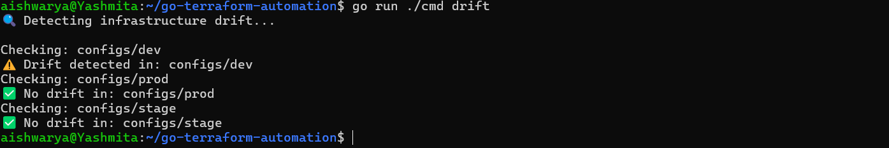

 Terraform Multi-Environment Automation & Drift Detection Engine

A production-style infrastructure automation tool built in Go to manage, audit, and validate Terraform-based environments at scale.

Focus: Automating infrastructure workflows using Go

 Overview

This project automates Terraform workflows across multiple environments (dev, stage, prod) with built-in support for:

Parallel infrastructure execution
Change detection via Terraform plan parsing
Drift detection using refresh-only plans
Audit report generation for infrastructure changes

Designed to simulate real-world SRE and platform engineering workflows.

 Features
 Multi-Environment Automation
Dynamically discovers Terraform workspaces
Executes plan/apply across environments
 Parallel Execution
Uses Go concurrency (goroutines + worker pool)
Controls execution using semaphores
 Change Detection (Audit System)
Parses terraform show -json
Extracts:
create
update
delete
no-op
 Audit Reports
Generates structured reports for infra changes
Logs per-environment modifications
 Drift Detection
Uses terraform plan -refresh-only
Detects manual infrastructure changes outside Terraform
🏗️Project Structure
.
├── cmd/                 # CLI commands (apply, report, drift)
├── internal/
│   ├── terraform/      # Terraform execution & parsing
│   └── report/         # Audit report generation
├── configs/            # dev, stage, prod environments
├── scripts/            # helper scripts
 Usage
Run Apply (Parallel Infra Execution)
go run ./cmd apply
Generate Audit Report
go run ./cmd report
Detect Drift
go run ./cmd drift
 Example Output
 Detecting infrastructure drift...

Checking: configs/dev
 Drift detected in: configs/dev

Checking: configs/prod
 No drift in: configs/prod

##  Example Output

Key Learnings
Terraform automation using Go (terraform-exec)
Infrastructure state vs real-world drift detection
Concurrent execution patterns in Go
Parsing complex JSON structures for infra insights

 Future Enhancements
Slack/Email alerts for drift
CI/CD integration (GitLab pipelines)
Auto-remediation of drift
Dashboard for infra visibility
